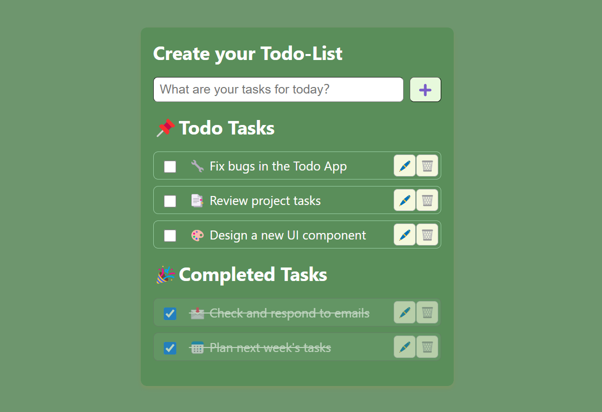

# Todo App (React + TypeScript)

## 🚀 Introduction
This is a **Todo List** application built with **React** and **TypeScript**. The app features a beautiful and user-friendly interface, providing convenient functionalities to help users manage their task lists efficiently.




🔗 **Demo**: [Todo App](https://todo-app-typescript-lake.vercel.app/)

## ✨ Key Features
✅ **Add new tasks**

✅ **Edit tasks**

✅ **Delete tasks**

✅ **Mark tasks as completed or pending**

✅ **Save data to Local Storage** (tasks persist even after refreshing the page)

✅ **Drag & Drop functionality for task sorting**

✅ **Responsive design for all devices**

---

## 🛠️ How to Run the Project

### 1. Clone the repository
```bash
 git clone https://github.com/thanhhang31023/todo-app-typescript.git
 cd todo-app-typescript
```

### 2. Install dependencies
```bash
 yarn install
```

### 3. Start the development server
```bash
 yarn start
```
Then open your browser and visit: `http://localhost:3000/`

## 📌 How to Use

**1️⃣ Enter your task in the input box and click `"➕"`  to add**

**2️⃣ Use the available buttons:**  
- 🖋️ **Edit** - Modify a task  
- ✅ **Mark as Done** - Mark a task as completed  
- 🗑️ **Delete** - Remove a task  

## 📬 Contact
- 👤 **NGUYEN THI THANH HANG**
- 📧 **thanhhang31023@gmail.com**

